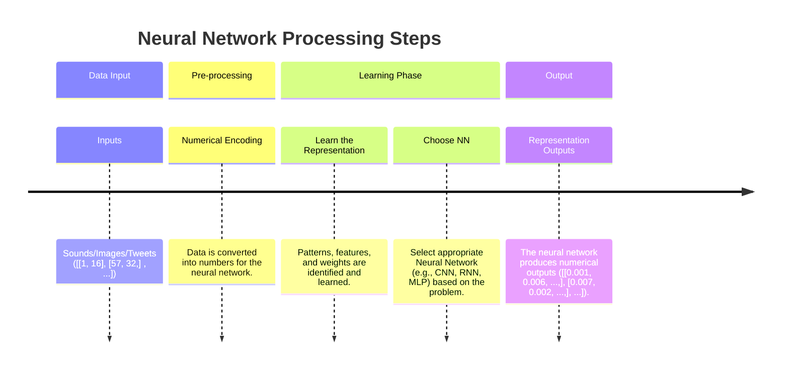

# TensorFlow and Deep Learning
* Write 100s of lines of TensorFlow code
* Have hands-on experience with two important problems in machine learning:
  - regression (predicting a number) and
  - classification (predicting if something is one thing or another).

# Fundamental 1.1: Intuition
## What is a `deep learning (DL)`?
A type of machine learning based on artificial neural networks in which multiple layers of processing are used to extracti progressively higher level features from data.\
DL is subset of ML. And ML is subset of AI.

## How does DL/ML differ from traditional programming?
* Traditional programming follows a rule-based approach where a programmer explicitly defines how to process input to get the desired output. You write the logic, and the program follows it.

* Machine learning, on the other hand, flips this approach. Instead of manually defining rules, ML starts with input and output data and learns the rules through pattern recognition. The algorithm finds relationships in the data, identifying patterns that allow it to generalize and make predictions on new inputs.

* Without DL/ML, many modern applications—like Google’s search engine, Netflix recommendations, and AI-driven customer support—wouldn’t exist in their current form. It’s not about replacing traditional programming but about expanding what’s possible.

* For complex tasks, you can't write rules like self driving car.

## You should not use machine learning in the following situations:
If you can build a simple rule-based system that doesn't require machine learning, do that.
  [Google's ML Handbook](https://developers.google.com/machine-learning/guides/rules-of-ml#before_machine_learning)
  
## What deep learning is good for?
* `Problem with long lists of rules` - when the traditional approach fails, machine learning/deep learning may help.
* `Continually changing environments`- deep learniing can adapt ('learn') to new scenarios
* `Discovering insights within large collection of data` - can you imagine trying to hand-craft rules for what 201 different kinds of food look like?

## What deep learnig is not good for?
* `when you need explainability / interpretability` - the patterns learned by DL model are typically uniterpretable by a human.
* `When the traditional approach is the better option` -  if you can accoumplish what you need with asimple rulw-based system.
* `When errors are unacceptable` - since the outputs of deep learnig model aren't always predictable.
* `When you don't have much data`- deep learning models usually require a fairly large amount of data to produce great results.

## Deep learning Vs Machine learning
* Traditional ML algorithes have typically performed best on structured data (excel spreadsheet/ google sheet).
* Where DL perform best on unstructured data like tweets, sound waves, webpage.
| Structured data         | Unstructured data (using Tensor Flow)  |
|-------------------------|-----------------------------|
| Random Forest           | Neural Networks                      |
| Naive bayes             | Fully connected NN       |
| Nearest Neighbor        | Convonutional NN   |
| Support vector machine  | Recurrent NN    |
| and many more...            | Transformer and many more... |

* Depending how you represent your problem, many algorithms can be used for both.

## What are neural networks?
Neural networks are a fundamental part of deep learning, inspired by the structure and function of the human brain. They consist of layers of interconnected nodes, or "neurons," that process and learn patterns from data.

## Anotomy of Neural Network
_(1).png)
* The individual dots you see in a neural network diagram are called neurons or units. Think of them as the fundamental processing nodes that receive inputs, perform a simple calculation, and then pass on an output.
* Patterns, embedding, weights, feature representation, and feature vectors used interchangeably.

## Deep Learning use cases
- Recommender system
- computer vision
- NLP (Spam, Not-spam)
- Translation (Hindi to English)
- Speech Recognition

## What is TensorFlow?
- End-to-end platform for machine learning
- Write fast deep learning code in Python/other accessible languages (able to run on a GPU/TPU)
- Able to access many pre-built deep learning modles (TensorFlow Hub)
- Whole stack: preprocess data, model data, deploy model in your application
- Originally designed and used in-house by Google (now open-source)

### Why TensorFlow?
* Easy mosel building
* Robust ML production anywhere
* Powerful experimentation for research

**Source**: [tensorflow.org](https://www.tensorflow.org/)

### **What is GPU/TPU?**

| **Component** | **Definition** | **Role in ML/DL** | **Key Features** |
|--------------|--------------|------------------|----------------|
| **CPU (Central Processing Unit)** | General-purpose processor for computing tasks | Handles standard computations and model management but is slower for ML training | Versatile but slower for parallel computations |
| **GPU (Graphics Processing Unit)** | Specialized processor for parallel computations | Accelerates ML/DL training by handling multiple calculations simultaneously | Optimized for matrix operations and deep learning workloads |
| **TPU (Tensor Processing Unit)** | Custom chip designed by Google for ML/DL | Built specifically for deep learning, offering faster training and inference for neural networks | Highly efficient for tensor operations, used in Google AI workloads |
| **CUDA (Compute Unified Device Architecture)** | NVIDIA’s framework for parallel computing on GPUs | Allows deep learning frameworks (TensorFlow, PyTorch) to leverage GPU acceleration | Used for optimizing ML/DL algorithms on NVIDIA GPUs |

GPUs and TPUs are essential for training deep learning models efficiently, while CUDA is a software platform that enables ML frameworks to harness GPU power.

### What is Tensor
A **tensor** is the fundamental data structure used in machine learning frameworks like TensorFlow, PyTorch, and JAX. At its core, you can think of a tensor as a multi-dimensional array.

