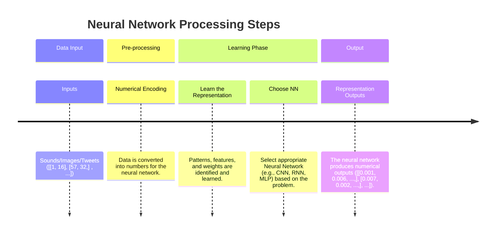
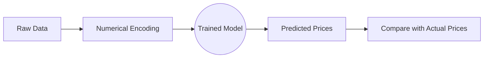
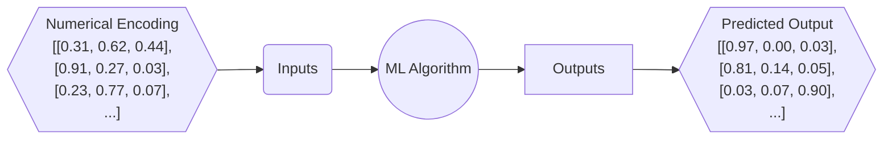

# TensorFlow and Deep Learning
* Write 100s of lines of TensorFlow code
* Have hands-on experience with two important problems in machine learning:
  - regression (predicting a number) and
  - classification (predicting if something is one thing or another).

---


# 1.1: Fundamental - Intuition
## What is a `deep learning (DL)`?
A type of machine learning based on artificial neural networks in which multiple layers of processing are used to extracti progressively higher level features from data.\
DL is subset of ML. And ML is subset of AI.

## How does DL/ML differ from traditional programming?
* Traditional programming follows a rule-based approach where a programmer explicitly defines how to process input to get the desired output. You write the logic, and the program follows it.

* Machine learning, on the other hand, flips this approach. Instead of manually defining rules, ML starts with input and output data and learns the rules through pattern recognition. The algorithm finds relationships in the data, identifying patterns that allow it to generalize and make predictions on new inputs.

* Without DL/ML, many modern applications—like Google’s search engine, Netflix recommendations, and AI-driven customer support—wouldn’t exist in their current form. It’s not about replacing traditional programming but about expanding what’s possible.

* For complex tasks, you can't write rules like self driving car.

## You should not use machine learning in the following situations:
If you can build a simple rule-based system that doesn't require machine learning, do that.
  [Google's ML Handbook](https://developers.google.com/machine-learning/guides/rules-of-ml#before_machine_learning)
  
## What deep learning is good for?
* `Problem with long lists of rules` - when the traditional approach fails, machine learning/deep learning may help.
* `Continually changing environments`- deep learniing can adapt ('learn') to new scenarios
* `Discovering insights within large collection of data` - can you imagine trying to hand-craft rules for what 201 different kinds of food look like?

## What deep learnig is not good for?
* `when you need explainability / interpretability` - the patterns learned by DL model are typically uniterpretable by a human.
* `When the traditional approach is the better option` -  if you can accoumplish what you need with asimple rulw-based system.
* `When errors are unacceptable` - since the outputs of deep learnig model aren't always predictable.
* `When you don't have much data`- deep learning models usually require a fairly large amount of data to produce great results.

## Deep learning Vs Machine learning
* Traditional ML algorithes have typically performed best on structured data (excel spreadsheet/ google sheet).
* Where DL perform best on unstructured data like tweets, sound waves, webpage.

  
| Structured data         | Unstructured data (using Tensor Flow)  |
|-------------------------|-----------------------------|
| Random Forest           | Neural Networks                      |
| Naive bayes             | Fully connected NN       |
| Nearest Neighbor        | Convonutional NN   |
| Support vector machine  | Recurrent NN    |
| and many more...            | Transformer and many more... |

* Depending how you represent your problem, many algorithms can be used for both.

## What are neural networks?
Neural networks are a fundamental part of deep learning, inspired by the structure and function of the human brain. They consist of layers of interconnected nodes, or "neurons," that process and learn patterns from data.

## Anotomy of Neural Network
_(1).png)
* The individual dots you see in a neural network diagram are called neurons or units. Think of them as the fundamental processing nodes that receive inputs, perform a simple calculation, and then pass on an output.
* Patterns, embedding, weights, feature representation, and feature vectors used interchangeably.

## Deep Learning use cases
- Recommender system
- computer vision
- NLP (Spam, Not-spam)
- Translation (Hindi to English)
- Speech Recognition

## What is TensorFlow?
- End-to-end platform for machine learning
- Write fast deep learning code in Python/other accessible languages (able to run on a GPU/TPU)
- Able to access many pre-built deep learning modles (TensorFlow Hub)
- Whole stack: preprocess data, model data, deploy model in your application
- Originally designed and used in-house by Google (now open-source)

### Why TensorFlow?
* Easy mosel building
* Robust ML production anywhere
* Powerful experimentation for research

**Source**: [tensorflow.org](https://www.tensorflow.org/)


### **What is GPU/TPU?**

| **Component** | **Definition** | **Role in ML/DL** | **Key Features** |
|--------------|--------------|------------------|----------------|
| **CPU (Central Processing Unit)** | General-purpose processor for computing tasks | Handles standard computations and model management but is slower for ML training | Versatile but slower for parallel computations |
| **GPU (Graphics Processing Unit)** | Specialized processor for parallel computations | Accelerates ML/DL training by handling multiple calculations simultaneously | Optimized for matrix operations and deep learning workloads |
| **TPU (Tensor Processing Unit)** | Custom chip designed by Google for ML/DL | Built specifically for deep learning, offering faster training and inference for neural networks | Highly efficient for tensor operations, used in Google AI workloads |
| **CUDA (Compute Unified Device Architecture)** | NVIDIA’s framework for parallel computing on GPUs | Allows deep learning frameworks (TensorFlow, PyTorch) to leverage GPU acceleration | Used for optimizing ML/DL algorithms on NVIDIA GPUs |

GPUs and TPUs are essential for training deep learning models efficiently, while CUDA is a software platform that enables ML frameworks to harness GPU power.


### What is Tensor
A **tensor** is the fundamental data structure used in machine learning frameworks like TensorFlow, PyTorch, and JAX. At its core, you can think of a tensor as a multi-dimensional array.

# 1.2: Neural Network Regression with TensorFlow
## What is a regression problem?
A **regression problem** is a type of supervised learning task where the goal is to predict a continuous numerical output based on one or more input features.
Some example regression problems:
- How much will this house sell for?
- How many people will buy this app?
- How much should I save each week for fuel?

## What we are going to do?
- Architecture of a neural network regresson model
- Input shapes and output shapes of a regression model (features and labels)
- Creating custom data to view and fit
- Steps in modleling
  * Creating a model
  * compiling a model
  * fitting a model
  * evaluate a model
- Different evaluation methods
- Saving and loading models


## How will we do?
**House price prediction**—you train a model using historical house prices and related features (e.g., square footage, location, number of rooms). The model learns patterns in the data and attempts to predict new house prices as accurately as possible.


## Architecture of the Regression Problem

| Hyperparameter          | Typical Value                                  |
|-------------------------|------------------------------------------------|
| **Input layer shape**   | Same as the number of features                 |
| **Hidden layer(s)**     | Problem-specific; minimum 1, maximum varies    |
| **Neurons per layer**   | Depends on complexity, often [32, 64, 128, ...]|
| **Output layer shape**  | 1 (single numerical output)                    |
| **Hidden activation**   | ReLU (Rectified Linear Unit)                   |
| **Output activation**   | Linear (for continuous output)                 |
| **Loss function**       | MSE or MAE / Huber Loss (combination of MAE/MSE) if outliers|
| **Optimizer**           | Adam / SGD (Stochastic Gradient Descent)       |


## **Example Problem**  
An example problem has been created using Kaggle's dataset, demonstrating a neural network regression problem on a large dataset.

---

# **1.3: Neural Network Classification with TensorFlow**

## **What is Classification?**  
Classification is a type of supervised learning where we predict classes based on input data (a discrete value), unlike regression, where we predict continuous values.  

> Classification is like teaching a computer to recognize patterns and make decisions.

### **Classification Problem Types**
- **Binary Classification**  
  - Example: Determining if an email is spam or not spam.  
- **Multiclass Classification**  
  - Example: Classifying images of a cat, rat, or dog.  
- **Multilabel Classification**  
  - A single sample can belong to multiple categories (e.g., identifying multiple objects in an image).

## **What We're Going to Cover**
* Architecture of a neural network classification model.
* Input shapes and output shapes of a classification problem (features and labels).
* Creating custom data to visualize and fit.
* **Steps in modeling:**
   * Creating, compiling, fitting, and evaluating a model.
* Different classification evaluation methods.
* Saving and loading models.

## **Input and Output for the Classification Task**
> **For an image classification example**


### **Input Shape**  
The input shape depends on the number of images and their dimensions. If you're using 100 images of size **64x64** pixels with **3 color channels** (RGB), the input shape would be:
```python
(100, 64, 64, 3)  # (num_images/batch_size, height, width, color_channels)
```
This represents:
- `100` images in the dataset  
- Each image is `64x64` pixels  
- `3` color channels (Red, Green, Blue)  

### **Output Shape**  
Since this is a **multiclass** classification problem (each image belongs to exactly **one** of the three categories), the output shape would be:
```python
(100, 3)  # (num_images, num_classes)
```
This represents:
- `100` images  
- `3` possible classes (Cat, Dog, Rat)  

Each output will be a probability distribution over the three classes, such as:
```python
[[0.97, 0.00, 0.03],  # This image is most likely a cat
 [0.11, 0.84, 0.05],  # This image is most likely a dog
 [0.03, 0.07, 0.90],  # This image is most likely a rat
 ...]
```
Where:
- The highest probability in each row indicates the predicted class.
- The model learns to adjust these probabilities as it trains.


## **Architecture of a Classification Model**
| **Hyperparameter**       | **Binary Classification**           | **Multiclass Classification**  |
|-------------------------|----------------------------------|-----------------------------|
| **Input layer shape**   | Same as the number of features  | Same as binary classification |
| **Hidden layer(s)**     | Problem-specific; minimum 1, maximum varies | Same as binary classification |
| **Neurons per layer**   | Depends on complexity, often [32, 64, 128, ...] | Same as binary classification |
| **Output layer shape**  | 1 (single numerical output) | 1 per class (e.g., rat, cat, dog) |
| **Hidden activation**   | ReLU (Rectified Linear Unit) | Same as binary classification |
| **Output activation**   | Sigmoid (for binary output) | Softmax (for multiclass output) |
| **Loss function**       | `BinaryCrossentropy` | `CategoricalCrossentropy` |
| **Optimizer**           | Adam / SGD (Stochastic Gradient Descent) | Same as binary classification |


## **Example Problem**  
An example problem has been done on `Fashion MNIST`, demonstrating a neural network classification problem on a large dataset.

---

# **1.4: Neural Network Text Classification with TensorFlow**

## Example 1: Diabetes Prediction (Feedforward Neural Network)

This example illustrates how a feedforward neural network can be used for a classic classification problem: predicting whether a patient has diabetes based on medical data.

### Feedforward Neural Network

A feedforward neural network is a type of artificial neural network where the connections between the nodes **do not form a cycle**.  Information moves in only one direction, from the input nodes, through the hidden nodes (if any), and to the output nodes. They are the simplest type of artificial neural network.


*   **Key Concepts Covered:**
    *   **Weights and Biases:**  The parameters that the network learns to make predictions.
    *   **Forward Propagation:** The process of feeding the input through the network to generate an output.
    *   **Backpropagation:** The process of calculating the gradients of the loss function with respect to the weights and biases, and using these gradients to update the weights and biases to minimize the loss.
    *   **Gradient Descent:** The optimization algorithm used to update the weights and biases.


## Example 2: Text Classification (Recurrent Neural Network)

This example illustrates how a recurrent neural network (RNN) can be used for text classification, such as sentiment analysis (positive, negative, neutral).

### Definition: Recurrent Neural Network (RNN)

Recurrent Neural Networks (RNNs) are a type of neural network designed to handle sequential data.  Unlike feedforward networks, RNNs have **feedback connections**, allowing information to persist across time steps. This makes them suitable for tasks where the order of data is important, such as natural language processing.


The difference between **folded** and **unfolded** RNNs is mainly in how they are represented for understanding and training.

- **Folded RNN**: This is a compact representation where the recurrent connections are shown as loops, making it harder to visualize how information flows over time.
- **Unfolded RNN**: This expands the network across multiple time steps, showing how the hidden state evolves. This representation is crucial for **backpropagation through time (BPTT)**, as it allows gradients to be computed across different time steps.

In practice, RNNs are trained using the **unfolded** version since it makes gradient calculations easier. However, during inference, the folded representation is sufficient since only the current hidden state needs to be maintained. You can read more about RNN unrolling [here](https://machinelearningmastery.com/rnn-unrolling/).
>`RNNs` and `FFNNs` differ mainly in handling sequential data. While FFNNs process inputs independently, RNNs retain memory of past inputs through recurrent connections, making them ideal for tasks where order matters. RNNs excel at modeling temporal dependencies, handling variable-length inputs, and sharing parameters efficiently across time steps. They're commonly used in NLP, time series analysis, speech recognition, and video processing. In contrast, FFNNs are better suited for tasks without inherent temporal structure.

#### **Problems with RNNs**:
* **Exploding Gradients** : This occurs when gradients become very large during backpropagation through time, leading to unstable models and an inability to learn.
* **Vanishing Gradients** : This happens when gradients become very small, approaching zero, which causes the model to stop updating and learning.
> **Solutions to RNN Problems**
* **Gated Recurrent Unit (GRU)** : This unit incorporates "gates" that help manage the flow of information, addressing the vanishing and exploding gradient problems.
* **Long Short-Term Memory (LSTM) Unit**: Similar to GRUs, LSTMs also use gates (three in this case) to control memory and combat the gradient issues, allowing them to learn long-term dependencies.
